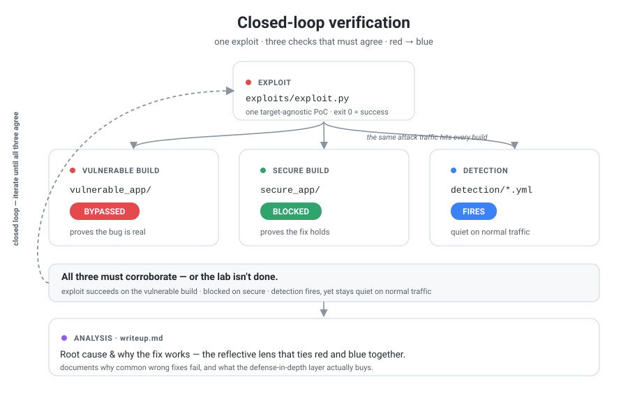

# web-security-notes

> Hands-on web security labs — each vulnerability reproduced from scratch in **both Python and Go**, then exploited and patched.

Not a collection of copy-pasted payloads. For every technique I build a minimal
vulnerable service, exploit it, find the root cause, then fix it — and I do it on
two language/framework stacks side by side so the underlying cause is obvious
rather than framework-specific.

## Why two stacks?

Each lab ships a `vuln-py` (Python) and a `vuln-go` (Go) implementation of the
same vulnerable feature. Running them side by side shows that the bug lives in
*how input is handled*, not in a specific framework — and it makes the secure vs.
insecure coding pattern concrete in both languages.

## Methodology — how I work

Every lab is worked through four purple-team lenses, and they have to agree with
each other:

- **Red / exploit** (`exploits/`) — a runnable PoC
- **Blue / fix** (`secure_app/`) — the same feature, patched
- **Blue / detect** (`detection/`) — Sigma rules that catch the attack traffic
- **Analysis** (`writeup.md`) — root cause, trade-offs, and why common wrong fixes fail

The core rule is a **closed loop**: the traffic my exploit generates must be
caught by my detection rules *and* blocked by the secure build. If the three
don't corroborate each other, the lab isn't done.

The full working standard — directory conventions, the closed-loop verification
steps, and the AI-as-reviewer boundary I hold myself to (I hand-write every lab
artifact; AI only reviews) — lives in [CLAUDE.md](CLAUDE.md).

## Labs

| #  | Technique                     | Category      | Writeup | Vuln code   | Fix |
|----|-------------------------------|---------------|:-------:|:-----------:|:---:|
| 01 | Login bypass via SQL injection | SQL Injection | v      | py / go     | v  |
| 02 | Blind SQL injection with conditional responses | SQL Injection | v      | py / go     | v  |

**Roadmap** — one technique per lab: UNION-based extraction, boolean-based blind,
error-based, time-based blind, out-of-band (OAST), and WAF/filter bypass.

## What each lab contains

- `writeup.md` — how the vuln works, how it's exploited, the root cause, and the fix
- `vulnerable_app/`, `secure_app/` — minimal vulnerable and patched services (Python + Go)
- `exploits/` — a target-agnostic PoC that hits every backend
- `detection/` — Sigma rules with documented false-positive boundaries

## Setup

```bash
cd {category}/{lab_name}

# Start Python stack (vuln-py on :8001)
docker compose --profile py up

# Start Go stack (vuln-go on :8002)
docker compose --profile go up

# Both, for side-by-side comparison
docker compose --profile py --profile go up
```

## What this repo demonstrates

- Reproducing web vulnerabilities end to end: exploit → root cause → patch → detect
- Reading and auditing the same logic across Python and Go
- Building isolated, reproducible lab environments with Docker Compose profiles

